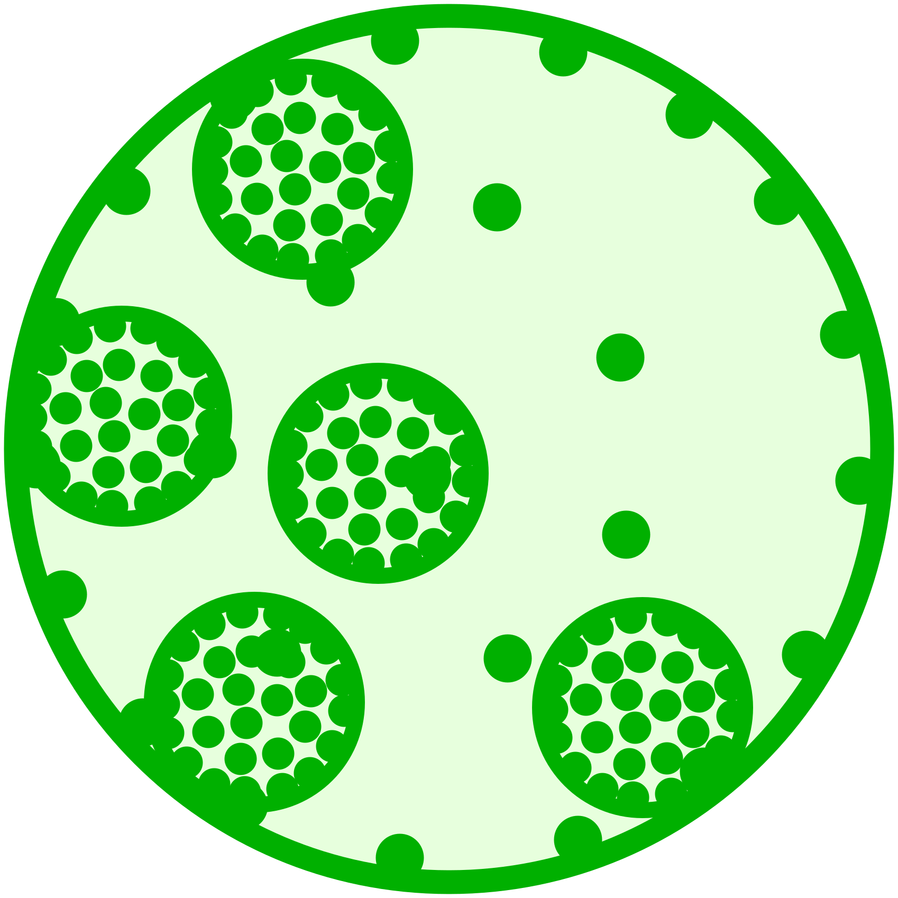

#  Volvox Programming Language Specification

## Basic Syntax Elements

```EBNF
digit = "0" ... "9"
positive_digit = "1" ... "9"
upper-case = "A" ... "Z"
lower-case = "a" ... "z"
letter = upper-case | lower-case | "_"
alphanum = digit | letter

identifier = letter [alphanum*]

octal_digit   = "0" ... "7"
hex_digit     = digit | "A" ... "F" | "a" ... "f"

decimal_unsigned = "0" | (positive_digit [digit*])
decimal_signed = ["-"] decimal_unsigned

hexadecimal = "0x" hex_digit [hex_digit*]
octal =  "0" octal_digit [octal_digit*]

exponent = ("E"|"e") decimal_signed
real = decimal_signed ("." [decimal_unsigned] [exponent]) | exponent
(remark: second dot as in 12.. would be beginning of range)
float = real "f"
signed = decimal_signed
unsigned = decimal_unsigned | hexadecimal | octal
```

## Operator Hierarchy

| Operator(s) | meaning | associativity |
| :--- | :--- | :--- |
| `.` | Selector (`struct.field`, `module.ident`) | left |
| unary `&` | Address (for C calls) | prefix |
| `++`, `--` | Increment, Decrement — return old value | postfix |
| `^` | power (e.g. `a^2`) | right |
| unary `+`, `-`, `!`, `~` | signs, logical / bitwise not | prefix |
|  | invisible operator in `echo sin x` | right |
| `*`, `/`, `%`, `<<`, `>>` | multiply, divide, modulo, bitwise shifts | left |
| `+`, `-` | binary plus, minus | left |
|  `>=`, `>`, `==`, `!=`, `<`, `<=` | Comparisons | left |
| `&` | bitwise and | left |
| `><` | bitwise exclusive or | left |
| `\|` | bitwise or | left |
| `&&` | logical and | left |
| `\|\|` | logical or | left |
| `..` | range (`for n in 1..3`) | left |
| `:` | field element assignment | left |
| `? :` | ternary expression | left |
| `,` | list element separator | left |
| `=`, `+=`, `-=`, `*=`, `/=` | assignments, return old value | right |

## Builtin Data Types
### Numeric Types
#### Integer Types

| Name (Alias) | Range / Spec | Suffix |
| :--- | :--- | :--- |
| `i8` | -128 .. 127 | `hh`, `HH` |
| `i16` | -32768 .. 32767 | `h`, `H` |
| `int`, `i32` | -2147483648 .. 2147483647 |  |
| `i64` | -9223372036854775808 .. 9223372036854775807 | `l`, `L` |
| `i128` | not implemented, yet | `ll`, `LL` |
| `ssize_t` | signed int large enough to hold pointer value | `z`, `Z` |
| `u8` | 0 .. 255 | `uhh`, `UHH` |
| `u16` | 0 .. 65535 | `uh`, `UH` |
| `unsigned`, `u32` | 0 .. 4294967295 | `u`, `U` |
| `u64` | 0 .. 18446744073709551615 | `ul`, `UL` |
| `u128` | not implemented, yet | `ull`, `ULL` |
| `size_t` | unsigned int large enough to hold pointer value | `uz`, `UZ` |

#### Floating Point Types

| Name (Alias) | Spec | Suffix |
| :--- | :--- | :--- |
| `real`, `f64` | IEEE-754 64 bit |  |
| `float`, `f32` | IEEE-754 32 bit | `f`, `F` |

#### Imaginary and Complex Types

| Name (Alias) | Spec | Suffix |
| :--- | :--- | :--- |
| `imaginary`, `j64` | 64 bit imaginary | `i`, `I` |
| `j32` | 32 bit imaginary | `fi`, `FI` |
| `complex`, `c64` | sum of `real` and `imaginary` | |
| `c32` | sum of `float` and `j32` | |

#### Logical Type

| Name | Values |
| :--- | :--- |
| `bool` | `false`, `true` |

#### Strings and Pointers

| Name | Syntax | Remarks |
| :--- | :--- | :--- |
| `string` | `"A String"` | Volvox string — automatically converted to `cstring` if necessary |
| `cstring` | | C-stype string, i.e. address of 1st character  — for C interoperability — automatically converted to `string` if necessary |
| `voidptr` | `&a` | address of object — for C interoperability |

## Type Propagation

The basic targets of type propagation in Volvox are:

- do not lose precision but allow reinterpretation
	- results for small absolute values should be as expected by user
	- mixed signed / unsigned expressions are propagated to signed
- do early type propagation so intermediate results are not truncated
- automatically convert to larger significant bit sizes but not to smaller. Conversions should be reversible.
- allow explicit conversions to lower bit sizes ignoring overflow

#### Early type propagation

```volvox
echo (2000000000 * 300000000)
```

*Output:*  
`826015744`

The compiler uses `int` as result type as this is the type of the two factors, so an overflow occurs. This is the same behaviour as seen in most other programming languages and is considered "correct" — in the sense of "as expected".

There are cases where an overflow *can* be avoided:

```volvox
echo (34L + 2000000000 * 300000000)
```

*Output:*  
`600000000000000034`

The compiler recognizes (because of the 64 bit integer `34L`) that in the end a 64 bit result is required and the factors of the multiplication are propagated to 64 bits before the multiplication is performed.

C does the same for the case 16 bit -> 32 bit but not for 32 bit -> 64 bit.

Another way for the original multiplication is an explicit conversion of the result:

```volvox
echo i64(2000000000 * 300000000)
```

*Output:*  
`600000000000000000`

## Derived Types

### Arrays

Arrays are stack allocated aggregates of several elements of the same type, e.g. 4 `real` numbers:

```volvox
a = [2, -2.25, 1.5, 0.0625]
echo a[0]
echo a[3]
a[1] = 3.5
echo a
```

*Output:*  
`2`  
`0.0625`  
`[       2,     3.5,     1.5,  0.0625 ]`

### Multidimensional Arrays

Multidimensional arrays can be seen as arrays of arrays:

```volvox
m = [[  12.5, -13.75, 3.25 ],
	 [ 0.125,    4.5, -2.5 ],
	 [   3.5,  -9.25, 1.75 ]]

echo m[0][2]
echo m[2][1]
```

*Output:*  
`3.25`  
`-9.25`

There is an alternative syntax that is more suitable for
large sparse arrays:

```volvox
a = 3
const b := 4
c = 5

m = [2][a][b][c]float{1: {2: {2: {0: 12.5f, 3: -6.4f }}}}

echo m[0][1][1][2]
echo m[1][2][2][0]
echo m[1][2][2][3]
echo
echo typeof(m)
```

*Output:*  
`0`  
`12.5`  
`-6.4`  
  
`[2][][4][]float`

The dimension can be compile time constants (constexpr)
or run time variables. The official *type* leaves those
run time values open.

Nevertheless even the dimensions that are determined at run time cannot be changed once the array is created. For that see `vec` below.

### Vectors (`vec`)

A `vec` is a heap allocated aggregate of elements of the same type. Unlike arrays a `vec` can grow or shrink at run time:

```volvox
v = vec{ 12.5, -4.75, 3.25, 6.0625 }

echo v[1]
echo v[3]
echo v.size
echo

# put new element at end of vec
v.push -13.5

echo v[4]
echo v.size
echo

# move all existing elements from index 1 upward and
# put new element at index position 1
v.insert(1, 3.125)

echo v[1]
echo v.size

# remove element at index position 3 and move all
# following elements downward
v.remove 3
echo v.size

# iterate over vector elements
for k in v
	# "echon" is like bash's "echo -n"
	echon "$k, "
end
echo
```

*Output:*  
`-4.75`  
`6.0625`  
`4`  
  
`-13.5`  
`5`  
  
`3.125`  
`6`  
`5`  
`12.5, 3.125, -4.75, 6.0625, -13.5,` 

### Maps

A `map` is similar to a `vec` where the indices do not have to be consecutive:

```volvox
m = map[int]real{ 6: 23.5, -3: 6.5, 2: 5.75, 17: -3.75 }

# iterate over map - keys will be sorted

# access existing element
echo m[-3]

# access non-existing element - returns 0.
echo m[5]

# insert/replace element
m[12] = 3.125
echo

# iterate over map
for key, value in m
	echo "$key: $value"
end
```

*Output:*  
`6.5`  
`0`  
  
`-3: 6.5`  
`2: 5.75`  
`6: 23.5`  
`12: 3.125`  
`17: -3.75`

For both keys and values the following types are supported:

- `int` / `i32`
- `unsigned` / `u32`
- `i64`
- `u64`
- `string`

The case `map[string]string` is sometimes called "dictionary":

```volvox
dict_eng_deu = map[string]string{
	"dog": "Hund",
	"cat": "Katze",
	"tree": "Baum"
}

echo "The German word for \"cat\" is \"${dict_eng_deu["cat"]}\"."
```

*Output:*  
`The German word for "cat" is "Katze".`

### Structures (`struct`)

A `struct` is an aggregate of elements that may have different types but have compile-time defined sizes.

```volvox
# The layout of a `struct` must be defined in advance

struct MyType {
	counter int
	values [3]real
	real # type name can be used as field name, but only once
}

s = MyType{
	values: [3]real{ 1: 4.5 }
	real: 34.75
}

echo s.counter
echo s.values[0]
echo s.values[1]
echo s.real
```

*Output:*  
`0`  
`0`  
`4.5`  
`34.75`

Structures can be nested:

```volvox
struct Type1 {
	counter int
}

struct Type2 {
	v real
}

struct Type3 {
	Type1
	y Type2
	z i64
}

s = Type3{ Type1: { counter: 4 }, y: { v: -6.25 }, z: -3 }

echo s.Type1.counter
echo s.y.v
echo s.z
```

*Output:*  
`4`  
`-6.25`  
`-3`

## Conditional Expressions

### if ... elif ... else ... end

```volvox
x = 23.25

if x < 10
	x += 2
elif x <= 15
	if x < 13
		x += 12.75
	end
elif x < 20
	x *= 5
else
	x += 1.5
end

echo x

```

This is the most well known conditional expression and works as expected. Please note that there is no `then` keyword.

### while ... else ... end

```volvox
x = -13.25

while x < 3.5
	y = x
	x += 3
else
	y = 14.75
end

echoc(x, y)
```

*Output:*  
`4.75, 1.75`

The body of the `while` loop runs as long as the condition in the head is `true`. If the condition is already false at the first run — and only in this case — the `else` branch is run. Please note that this behaviour is different from Python's.
Running either the `while` branch or the `else` branch allows variable declarations inside these branches that remain valid after the loop as long as the definitions occur in both branches with the same type.

Try to change the first line in the example is changed to:

```volvox
x = 13.25
```

The `else` branch will run and the output will become  
`13.25, 14.75`

### repeat ... until

The `repeat` loop differs from the `while` loop in the fact that it is run at least once in any case and the condition is checked at the end. It has no `else` branch and variables declared inside the body always remain valid after the end of the loop.

```volvox
x = -13.25

repeat
	y = x
	x += 3
until x > 3.5

echoc(x, y)
```

*Output:*  
`4.75, 1.75`

If the sign is removed in the first line the output becomes  
`16.25, 13.25`

### for ... else ... end

```volvox
x = 3

for k in 0 .. x
	echo "$k * $k = ${k^2}"
	y = 12.75
else
	y = -13.5
end

echoc(x, y)
```

The `for` is very similar to the `while` loop except that the condition is formed by an *iterator* — in this case a range expression `0 .. x`. Other supported iterators are arrays, `vec` and `map` and `set`.

## Functions

Functions are subroutines that accept a number of arguments and may or may not return a value.

```volvox
def avg(x real, y real) real
	return 0.5 * (x + y)
end

a = 3.75
b = 4.5
c = avg(a, b)

echo c
```

*Output:*  
`4.125`

Functions may be recursive:

```volvox
def factorial(n u64) u64
	if n == 0
		return 1
	else
		return n * factorial(n - 1)
	end
end

m = 19

# if a function accepts less than 2 arguments braces
# are usually not needed

f = factorial m

echo "$m! = $f"
```

*Output:*  
`19! = 121645100408832000`

### Call by Reference

Normally function arguments are local copies of the values passed by the caller. However, an ampersand (`&`) as prefix makes the argument a reference:

```volvox
def reduce(&numerator u64, &denominator u64)
	# find greater and smaller of the two values
	if numerator > denominator
		greater = numerator
		smaller = denominator
	else
		smaller = numerator
		greater = denominator
	end
	# Euklid's algorithm to find greatest common denominator
	while true
		remainder = greater % smaller
	brk remainder == 0
		greater = smaller
		smaller = remainder
	end
	# numerator and denominator are references to a and b
	# from the caller so thode values are actually changed
	numerator /= smaller
	denominator /= smaller
end

a = 114051889UL
b = 113252445UL

reduce(a, b)

echo "$a : $b"
```

### Methods

A method is a special function that is associated to a `struct`. The method is called by appending the method name (separated by a dot) to an object of that `struct` type. The object itself can be referenced with `this` inside the method body:

```volvox
struct Vec2d {
	x real
	y real
}

def Vec2d.scale(factor real)
	this.x *= factor
	this.y *= factor
end

v = Vec2d{ x: 2.25, y: -0.0625 }

v.scale(2.5)

echo "${v.x} ${v.y}"
```

*Output:*  
`5.625 -0.15625`

### Constructors

A Constructor is a special method that is called when an object of a specific struct type comes into existence.

#### Standard Constructor

A standard constructor has no arguments and is never called explicitly:

```volvox
struct Vec2d {
	x real
	y real
}

# standard constructor has no arguments
def Vec2d
	this.x += 2.0
	this.y -= 3.0
end

# standard constructor is implicitly called after
# explicit initialization
v = Vec2d{ x: 2.25, y: -0.0625 }

echo "${v.x} ${v.y}"

# standard constructor is implicitly called after
# a low-level copy has been made
w = v

echo "${w.x} ${w.y}"
```

*Output*  
`4.25 -3.0625`  
`6.25 -6.0625`

#### General Constructor

A general constructor accepts arguments and is called explicitly to initialize an object:

```volvox
from math import sin, cos, pi

struct Vec2d {
	x real
	y real
}

# general constructor that accepts polar coordinates
def Vec2d(r real, phi real)
	this.x = r cos phi
	this.y = r sin phi
end

# a general constructor is called like a function
# 'this' is a reference to 'v' in this case
v = Vec2d(6, 30 * pi / 180)

echo "${v.x} ${v.y}"
```

### Destructor

A destructor is a method that is called implicitly when an object goes out of scope.

Since scopes are in Volvox are more sloppy than in some other languages this usually means:

- An object is declared inside a function and the function finishes (and the object is not the return value)
- An object is declared in one branch of a conditional expression but not in the other branches an that one branch finishes:

```volvox
struct Vec2d {
	x real
	y real
}

# general constructor that accepts polar coordinates
def ~Vec2d
	echo "Destructing Vec2d with x: ${this.x}, y: ${this.y}"
end

if 3 > 2
	g = Vec2d{ x: -1.5, y: 7.25 }
end

# 'g' is out of scope here, so the destructor is called
```

*Output:*  
`Destructing Vec2d with x: -1.5, y: 7.25`

## Scope of Objects

In general objects that are declared in a function (including the head) are local to that function and objects declared outside of functions are local to the main context:
 
```volvox
def f(x real) real
	k = x^2 + 3
	# x and k are local to f
	echo "x: $x, k: $k"
	return k
end

x = 45.75
k = -6.25

y = f(k)
# x and k are local to main context

echo "x: $x, k: $k, y: $y"
```

*Output:*  
`x: -6.25, k: 42.0625`  
`x: 45.75, k: -6.25, y: 42.0625`

## Libraries / Modules
### File Layout

Libraries (in the following also called modules) consist of one or more Volvox files in a directory underneath a library search path. Let's assume `/my/path/lib` is in this path then a Library named `mylib` and a sub-library `mylib.sublib` could consist of the following files:

```
/my/path/lib/mylib/10_basic.vx
/my/path/lib/mylib/20_impl.vx
/my/path/lib/mylib/30_compl.vx
/my/path/lib/mylib/sublib/a.vx
/my/path/lib/mylib/sublib/b.vx
```

The directory `mylib` is the only place where the library name is defined. This makes it easy to rename a library without touching the files — in particular if relative import paths are used between `mylib` and `mylib.sublib` (see [below](#relative-import-paths))

### Import

Identifiers from libraries can be imported in three ways:

1. Import of specific Identifiers:    
   `from mylib import id1, id2`    
   `id1` and `id2` can be used without qualifier
2. Import of complete library  
   `import mylib.sublib`  
   All identifiers of the library can be used but must be preceded by the qualifier `sublib.` (the last part of the full library name), i.e. `sublib.id3`, `sublib.id4`.
3. Import of complete library defining another qualifier    
   In case of name conflicts or just for more comfort it is possible to use a qualifier that is different from the last part of the full library name:  
   `import mylib as yourlib`  
   Now identifiers can be qualified like `yourlib.id1`, `yourlib.id2`.

#### Relative Import Paths

* Import from sub module  
  To import from `mylib.sublib` into `mylib` you can refer to `.sublib`:  
  `import .sublib`  
  This will provide `sublib.id3`, `sublib.id4`
* Import from higher level module  
  To import from `mylib` into `mylib.sublib`:  
  `from .. import id1, id2`  
  This will provide `id1` and `id2` without qualifier. For a qualified import the "`as`" syntax would by mandatory.
